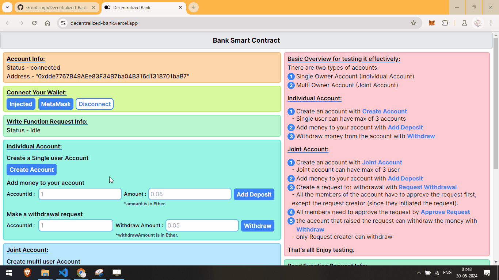
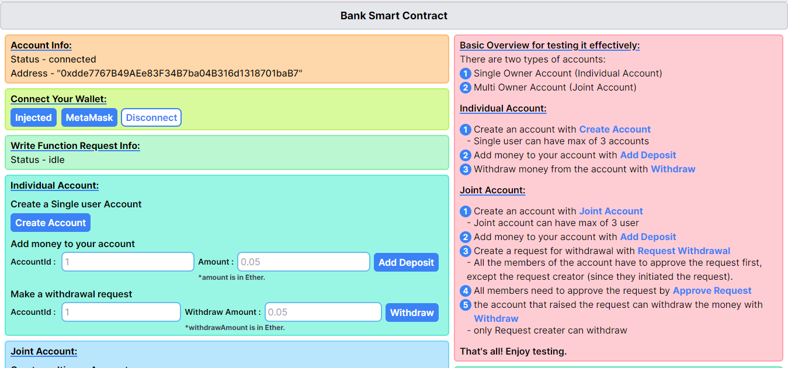
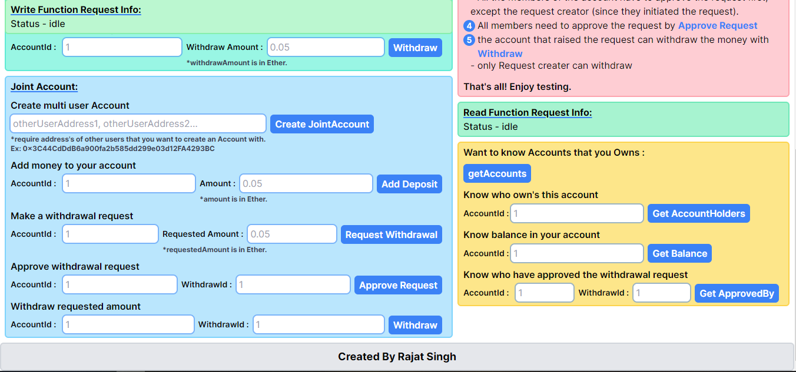

#  Decentralized Bank

Welcome to the Decentralized Bank project! This repository contains the source code for a web3 banking application built on the blockchain. The project supports two types of accounts: Single Owner Accounts (Individual Accounts) and Multi Owner Accounts (Joint Accounts).

## Try It Out

The Decentralized Bank application is live! 🎉 You can try it out at the following link:

🔗 **[Decentralized Bank Live](https://decentralized-bank.vercel.app/)**

## Project Overview

Decentralized Bank is designed to provide a decentralized banking experience. Users can create and manage their own accounts with enhanced security and transparency, leveraging blockchain technology.

### Features

- **🔒 Single Owner Account (Individual Account)**: A traditional bank account managed by a single user.
- **👥 Multi Owner Account (Joint Account)**: A joint account that can be managed by multiple owners.
- **🔗 Blockchain Integration**: The backend smart contracts are deployed on the Sepolia testnet, ensuring secure and verifiable transactions.
- **💻 User-friendly Interface**: The frontend is built using Next.js and Tailwind CSS, providing a modern and responsive user experience.
- **🌐 Web3 Integration**: Utilizing the wagmi library for seamless interaction with blockchain wallets and smart contracts.
- **🛠️ Testing**: Comprehensive testing to ensure the reliability and security of the smart contracts.

## Technologies Used

### Frontend

- **⚛️ Next.js**: A React framework for building fast and scalable web applications.
- **🎨 Tailwind CSS**: A utility-first CSS framework for creating custom designs without writing much CSS.
- **🔌 wagmi**: A collection of React hooks and utilities for working with Ethereum.

### Backend

- **🔧 Hardhat**: A development environment for compiling, deploying, testing, and debugging Ethereum software.
- **📝 Solidity**: The programming language used for writing the smart contracts.

## Demo

Here are some screenshots of the Decentralized Bank application in action:

## ⭐ Give Us a Star

If you like this project, please give this repo a star! ⭐ Your support is greatly appreciated.
